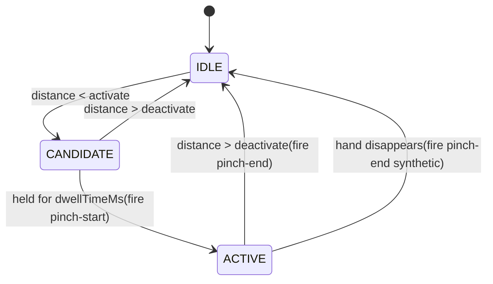

# ADR-0006: Pinch detection algorithm

* Status: accepted
* Workload: 3h
* Decider: [Florian Fertikowski](https://github.com/florian-fertikowski)
* Issue: [2](https://github.com/mi-classroom/mi-web-technologien-beiboot-ss2026-florian-fertikowski/issues/2)
* Date: 2026-05-31

## Context

The gesture vocabulary (see [gesture-vocabulary.md](../gesture-vocabulary.md)) selects Pinch as the gesture for the "Confirm" interaction in the near range.

What the algorithm needs to handle:

1. Hand size and camera distance change the absolute distance.
2. Landmark jitter
3. Fleeting contacts trigger false positives.
4. Threshold oscillation causes flicker.

## Considered Options

For each of the four problems above, the alternatives are:

**Distance normalization**

- **Absolute distance threshold**: compare raw 3D distance between landmarks.
- **Hand-size-relative distance**: divide raw distance by an intra-hand reference distance (e.g. wrist to middle-finger MCP).

**Jitter handling**

- **No smoothing**: use raw per-frame distance.
- **EMA smoothing** of the distance signal.
- **Median filter** over the last N frames.

**Flicker prevention**

- **Single threshold**: same threshold for activation and release.
- **Hysteresis**: separate thresholds for activation and release, with the release threshold strictly higher.

## Decision

The Pinch detector combines all four mitigations:

1. **Hand-size-relative distance.** The raw tip-to-tip distance is divided by the distance from wrist (landmark 0) to middle-finger MCP (landmark 9). The result is a dimensionless ratio that does not depend on hand size or camera distance.
2. **EMA smoothing** of the relative distance with α = 0.4.
3. **Hysteresis** with two thresholds: 0.3 for activation, 0.45 for release.

The four mitigations are composed into a small per-hand state machine with three phases (IDLE, CANDIDATE, ACTIVE) and emit `pinch-start` and `pinch-end` events at the transitions.

All parameters (thresholds, dwell time, smoothing factor) are configurable via the detector's constructor options. The defaults were chosen during initial testing on a 1280×720 stream at close range.

## Pros and Cons of the Options

### Distance normalization

#### Absolute distance threshold

**Pros**

- Simple, no reference landmark needed

**Cons**

- Same gesture fails at different distances from the camera
- Same gesture fails for different hand sizes
- The threshold would have to be re-tuned for each user and
  scenario

#### Hand-size-relative distance (chosen)

**Pros**

- Invariant to hand size and camera distance
- One threshold value works across users and distances

**Cons**

- Requires four landmarks to be present, not two; if any are missing the frame is skipped

---

### Jitter handling

#### No smoothing

**Pros**

- Lowest latency, gesture reacts immediately

**Cons**

- Issue #1 observed that individual extended fingers visibly jitter, which the per-frame distance signal would inherit and cause false triggers and flicker

#### EMA smoothing (chosen)

**Pros**

- Single state variable per hand, cheap to maintain
- α factor exposes a clear trade-off between reactivity and stability
- Industry-standard approach for noisy real-time signals

**Cons**

- Adds a small lag to gesture activation (proportional to 1/α)

#### Median filter

**Pros**

- More robust to outliers than EMA

**Cons**

- Requires storing the last N frames per hand
- Less standard for sub-second smoothing of continuous signals
- EMA was sufficient in testing; no need to escalate

---

### Flicker prevention

#### Single threshold

**Pros**

- Simpler

**Cons**

- Distance oscillating near the threshold rapidly toggles the
  gesture state, causing visible flicker and spurious events

#### Hysteresis (chosen)

**Pros**

- Standard solution for threshold systems with noisy input
- Eliminates flicker entirely by separating "enter" and "exit" conditions

**Cons**

- Two parameters to tune instead of one

## Default parameters

The defaults below were chosen during initial testing:

| Parameter             | Default | Rationale                                                                |
|-----------------------|---------|--------------------------------------------------------------------------|
| `activateThreshold`   | 0.3     | Fingers must clearly touch, not just be near each other                  |
| `deactivateThreshold` | 0.45    | Enough hysteresis to absorb residual jitter after smoothing              |
| `dwellTimeMs`         | 200     | Short enough to feel responsive, long enough to reject reflexive touches |
| `smoothingAlpha`      | 0.4     | Visibly smoothed without feeling sluggish                                |

## State machine

Per-hand state transitions:
