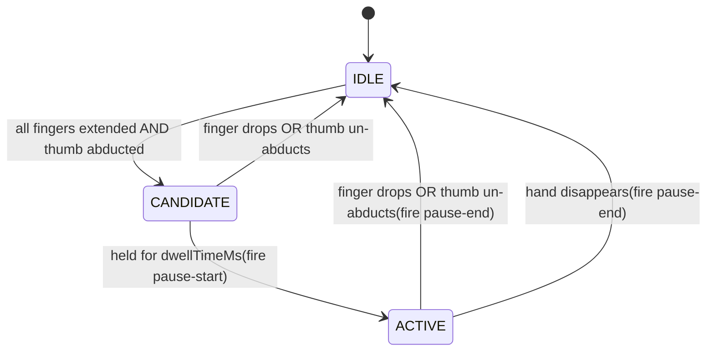

# ADR-0009: Pause detection algorithm

- Status: accepted
- Workload: 1h
- Decider: [Florian Fertikowski](https://github.com/florian-fertikowski)
- Issue: [3](https://github.com/mi-classroom/mi-web-technologien-beiboot-ss2026-florian-fertikowski/issues/3)
- Date: 2026-05-XX

## Context

The gesture vocabulary ([gesture-vocabulary.md](../gesture-vocabulary.md)) selects an open-palm hold as the gesture for the "Pause" interaction.

Open Palm is one of the gestures MediaPipe's built-in classifier
recognizes out of the box. The question is whether to use that
classifier or detect the posture from raw landmarks. The decision
has implications beyond Pause: it sets the precedent for how the
library handles posture-style gestures going forward, including
Pointing in [ADR-0010](./0010-pointing-detection.md).

A second design question is how to express "open palm" from
landmarks, since unlike Pinch (one tip distance) or Swipe (one
trajectory) Open Palm is a _composite_ posture: all four fingers
extended _and_ thumb abducted. The check has to combine multiple
finger states without becoming flaky on any one.

## Considered Options

For **detection source**:

- **MediaPipe's gesture classifier**: feed the `GestureRecognizer`
  result into the detector and check whether the top
  classification is "Open_Palm".
- **Bottom-up from landmarks**: compute "open palm" ourselves
  from the hand landmarks, identical input shape to Pinch and
  Swipe.

For **finger-extension check**:

- **Tip-to-MCP distance**: each finger counts as extended if the
  distance from its tip to its MCP exceeds a threshold relative
  to hand length.
- **Joint angle at PIP**: each finger counts as extended if the
  angle MCP-PIP-TIP is close to 180°.

For **thumb-abduction check**:

- **Tip-to-index-MCP distance only**: thumb is abducted if its
  tip is far from the index MCP.
- **Distance plus direction**: also require the thumb to extend
  _sideways_ from the hand's long axis, not parallel to it.

## Decision

**Detection source: bottom-up from landmarks**, using shared
helpers in `utils/finger-postures.ts` that Pointing also uses.

**Finger-extension check: tip-to-MCP distance** with hysteresis
between activation and release thresholds.

**Thumb-abduction check: distance plus direction.** A separate
direction test on the hand's long axis distinguishes a side-
abducted thumb from a thumb folded over the palm.

A state machine with IDLE / CANDIDATE / ACTIVE phases mirrors
Pinch, including dwell-time and hysteresis. One hand at a time
can drive the gesture (Pause is a binary app state, not a per-
hand action).

## Pros and Cons of the Options

### Detection source

#### MediaPipe's gesture classifier

**Pros**

- Trivial to implement: read the top category from each frame.
- Benefits from a model trained on diverse hands.

**Cons**

- Ties the library to a specific classifier model. If a consumer
  uses TF.js Hand Pose or any non-MediaPipe pipeline, this
  detector doesn't work.
- The classifier is rotation-sensitive in our own testing (Issue
  #1) — the same posture is classified inconsistently depending
  on hand orientation.
- Issue #2 already established the principle that gestures
  should be built from raw landmarks ("treats gestures as black
  boxes — building from landmarks gives explicit control"). Using
  the classifier here would be a quiet reversal of that
  principle for one gesture.

#### Bottom-up from landmarks (chosen)

**Pros**

- Consistent input contract across all four library gestures —
  every detector reads hand landmarks, none reads a classifier
  output.
- The library stays model-agnostic. Any provider of the standard
  21-landmark hand shape works.
- The helpers built for Pause (`isFingerExtended`,
  `isFingerCurled`, `isThumbAbducted`) are immediately reusable
  by Pointing (next ADR), which validates the helper layer.
- Explicit control over thresholds, hysteresis, and tuning, like
  Pinch and Swipe.

**Cons**

- More code than reading a single classifier string.
- We have to define "open palm" geometrically, which means
  thinking about edge cases (relaxed pinky, thumb position)
  that the classifier would smooth over implicitly.

### Finger-extension check

#### Tip-to-MCP distance (chosen)

**Pros**

- Same shape of check as Pinch (relative distance, hand-length
  normalization). Reuses the mental model.
- Cheap to compute.
- Naturally tolerant: a slightly bent finger that still extends
  past most of its length still counts as extended.

**Cons**

- A finger folded _toward the camera_ (Z direction) shortens in
  2D projection and reads as curled. Documented as a known
  limitation; affects Pointing more than Pause.

#### Joint angle at PIP

**Pros**

- More directly captures the anatomical meaning of "extended"
  (joint is straight).
- Slightly less sensitive to camera distance (angles are
  scale-invariant).

**Cons**

- Requires vector math (cross product or arccos), more code per
  call.
- Doesn't actually solve the camera-direction problem (a finger
  pointing into the camera still flattens in projection).
- Marginal benefit over distance for the test scenarios.

### Thumb-abduction check

#### Tip-to-index-MCP distance only

**Pros**

- Single distance computation, very simple.

**Cons**

- Cannot distinguish a side-abducted thumb (genuine open palm)
  from a thumb folded _across the palm_ (e.g. closing a fist by
  starting with the thumb). Both have a large distance from
  thumb tip to index MCP in some hand orientations.
- This caused a real false-positive during integration testing:
  any pose where the thumb sat above the palm triggered Pause.

#### Distance plus direction (chosen)

**Pros**

- Distinguishes the two cases by checking that the thumb extends
  _across_ the hand's long axis, not _along_ it.
- Implementation: compare the angle between the
  wrist-to-middle-MCP vector and the wrist-to-thumb-tip vector.
  A side-abducted thumb produces an angle of ~60-90°. A
  folded-over thumb produces an angle close to 0° (parallel to
  the hand axis).
- Catches the false positive observed during integration.

**Cons**

- Vector math (cosine via dot product) for what looks like a
  single feature check.
- Two thresholds to tune (distance and angle) instead of one.

## Default parameters

The defaults below started from inspection and were refined
during integration testing on the author's setup.

| Parameter                   | Default | Tuned value |
| --------------------------- | ------- | ----------- |
| `activateExtendedThreshold` | 0.7     | 0.6         |
| `releaseExtendedThreshold`  | 0.55    | 0.45        |
| `thumbAbductionThreshold`   | 0.5     | 0.35        |
| `thumbAngleMinDeg`          | 30      | 30          |
| `thumbAngleMaxDeg`          | 120     | 120         |
| `dwellTimeMs`               | 250     | 250         |

The thumb distance default (0.5) was unreachable on the author's
hand at typical camera distance — the actual ratio for a clearly
abducted thumb was 0.43-0.46. Lowering it to 0.35 with the angle
check still in place gives reliable detection without false
positives.

## State machine

Only one hand at a time drives the gesture. If multiple hands
show the posture simultaneously, the first to enter ACTIVE owns
the state until release.

## Consequences

- The `utils/finger-postures.ts` module ships as library-internal
  code, not part of the public API. The helpers are tied to the
  standard 21-landmark hand shape and would not generalize to
  other landmark schemes.
- The shared helpers reduce drift between Pause and Pointing:
  the same definition of "extended" applies to both. If the
  threshold is wrong for one, it is wrong for both, and we fix
  in one place.
- Default thresholds may need re-tuning for users with different
  hand geometries or different camera distances. The discrepancy
  between the initial defaults and the working values on the
  author's setup (documented above) underlines this — the
  defaults shipped with the library are a starting point.
- The thumb-direction check sets a precedent for using simple
  vector math when 2D projection alone is ambiguous. Pointing
  faces the same projection problem (a finger pointing into the
  camera) but in a form vector math does not solve cleanly —
  see ADR-0010 for that trade-off.
